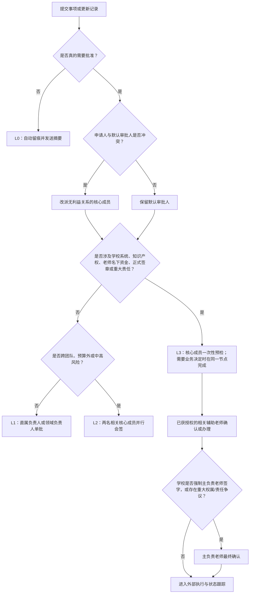

# 团队成员申请与分级审核方案（小团队版）

> 适用团队：1 名主负责老师、共 1～2 名资金/专利软著辅助老师（可一人兼任两个职能）、3 名主负责人、2 名同层级主贡献者、约 30 名普通成员
>
> 评估基线：TeamForge Platform v2.1.0（2026-07-27）
>
> 方案日期：2026-07-28
>
> 文档性质：组织规则、操作流程、复杂度评估与软件改造依据
>
> 2026-07-29 补充：成员访谈产生的组织层级、资料权限、项目协作和页面语义修改，详见《小团队反馈归纳与版本改造说明》。本文第 7～8 节记录的是 2026-07-27 主分支基线审计和目标差距，不代表小团队分支当前实现；实际完成项与延后项以补充说明第 4 节为准。

---

## 0. 先给结论

如果直接沿用当前系统的全局角色和通用审批流来管理这支团队，**会比现在更繁琐**，并且会把过多事项推给老师。主要原因不是申请表太多，而是当前系统无法准确表达：

- 3 名主负责人分别管理哪些成员；
- 2 名主贡献者虽然与主负责人同层级，但分别负责什么领域；
- 1～2 名辅助老师中，谁承担资金、谁承担专利软著，是否由同一人兼任；
- 哪些事项只需记录，哪些事项才真正需要批准；
- 老师是在团队内“做决定”，还是只负责代走学校系统。

推荐采用以下规则：

1. **3 名主负责人和 2 名主贡献者统一属于 5 人核心管理组，治理层级相同。**
2. 同层级不代表每件事都要 5 人审核；每个人按“直属成员、项目、事项领域、代理范围”处理自己的事项。
3. 日常任务、周报、普通资料更新只留痕，不审批。
4. 普通申请默认只经过 1 名学生负责人。
5. 跨团队或中风险事项最多 2 名核心成员并行确认，不串行经过 5 个人。
6. 老师只处理学校制度、知识产权、学校经费、正式签章、重大争议等必须由老师介入的事项。
7. 知识产权可以保留完整的十几个状态，但常规正式申请只保留“一名学生侧业务确认人”和“一名指定老师确认人”两道决策门；提案阶段不再重复审批，其他均为材料工作或进度记录。
8. 资金/专利软著辅助老师办理学校系统，不应被重复定义为团队内部第二、第三道批准人。
9. 普通成员的标准体验应是“填写一次、提交一次”；负责人是“看一张决策卡、作一次决定”；老师只看完整材料包。

目标控制线：

- 60%～70% 的日常事项：只记录，不产生待审批；
- 25%～35% 的事项：仅 1 人审批；
- 5%～10% 的事项：进入 L2 跨团队会签或 L3 老师/学校环节；
- 主负责老师接触的事项：尽量低于全部事项（含 L0 记录）的 5%；
- 除重大治理表决外，任何流程不得要求 5 名核心成员依次审批。

---

## 1. 团队身份如何映射

### 1.1 推荐身份结构

“资金辅助老师”和“知识产权辅助老师”是两个功能角色，不等于必须安排两个人。辅助老师实际总数仍为 1～2 人：只有 1 人时可兼任两个职能；有 2 人时再按领域分工。系统应记录“这个人负责哪些职能”，不能用人数推断职责。

| 实际身份 | 数量 | 组织层级 | 默认职责 | 默认是否审批日常事项 |
|---|---:|---|---|---|
| 主负责老师 | 1 | 老师责任层 | 知识产权权属与署名、正式签章、重大例外、学校责任事项 | 否 |
| 资金辅助老师（功能角色） | 1 个职能，可兼任 | 老师支持层 | 学校经费系统、报销、资金证明及校内流程 | 否，仅处理资金领域 |
| 专利软著辅助老师（功能角色） | 1 个职能，可兼任 | 老师支持层 | 科研处、专利/软著平台、校内材料与进度对接 | 否，仅处理知识产权领域 |
| 主负责人 | 3 | 学生核心管理层 | 分别管理成员、项目和日常执行 | 是，审核自己范围内事项 |
| 主贡献者 | 2 | 学生核心管理层 | 领域管理、轮值、代理、跨团队协调 | 是，权限与主负责人同层级 |
| 普通成员 | 约 30 | 执行层 | 执行任务、提交记录和必要申请 | 否 |
| 系统管理员 | 1～2，可由核心成员兼任 | 技术角色 | 账号、权限配置、数据维护 | 不因“系统管理员”身份自动获得业务审批权 |

### 1.2 两名主贡献者的定位

两名主贡献者必须在系统中被定义为“核心管理成员”，不能继续只显示为普通成员或项目核心成员。

他们与 3 名主负责人同层级，但默认路由可以不同：

- 3 名主负责人：按直属成员或项目接收日常申请；
- 2 名主贡献者：按事项领域、代理关系和轮值异常接收申请；
- 两名主贡献者不是所有申请的第二道审核；
- 当主负责人请假、利益冲突或超时时，主贡献者可作为同层级代理；
- 当主贡献者本人申请时，由另一名无利益关系的核心成员审批。

推荐起步分工，可在团队确认后调整：

| 核心岗位 | 建议范围 |
|---|---|
| 主负责人 A | 团队 A 的直属成员和项目 |
| 主负责人 B | 团队 B 的直属成员和项目 |
| 主负责人 C | 团队 C 的直属成员和项目 |
| 主贡献者 D | 资金预审、团队运营、成员与权限、轮值代理 |
| 主贡献者 E | 知识产权材料预审、成果与贡献、资料质量、轮值代理 |

### 1.3 组织身份与系统权限必须分开

一个人可以同时拥有多个维度：

```text
基础身份：老师 / 学生核心 / 普通成员
直属关系：谁管理谁
项目身份：负责人 / 核心成员 / 参与者
领域职责：资金 / 知识产权 / 成员管理 / 对外发布 / 敏感资料
代理关系：代理谁、代理到什么时候、代理哪些事项
技术权限：系统管理员 / 数据维护
```

不能再用一个“老师”或“管理员”字段决定所有权限。尤其要避免：

- 老师因为身份是 teacher，就自动看到全部贡献、全部敏感资料和全部普通审批；
- 系统管理员因为能维护数据，就自动可以批准自己的业务申请；
- 将通用审批节点设置为 member，导致所有普通成员都有机会成为审批人。

---

## 2. 先区分四种动作

很多流程变长，是因为把不同动作都叫作“审核”。系统和制度应明确区分：

| 动作 | 含义 | 是否占用审批层级 |
|---|---|---|
| 记录/告知 | 更新任务、周报、材料状态、学校反馈 | 否 |
| 验收/事实核对 | 检查任务是否完成、票据是否齐全、材料是否归档 | 不算组织审批，只由指定责任人处理 |
| 审批决定 | 决定事项是否允许执行、资金是否可用、权限是否可开 | 是 |
| 外部流程执行 | 辅助老师在科研处、财务系统或学校平台提交 | 不是团队内部重复审批 |

本方案同时使用两个计数，避免把“审批很短”误解为“没人需要做事”：

- **决策门数**：需要作出允许、拒绝或授权决定的关口数；
- **人工处理节点数**：申请提交后，团队内实际还要查看、核对、验收、决定或代办的人次；不含申请人填写，不含外部学校部门，不含只收到通知的人；
- 两名核心成员在同一轮并行会签，计作 **1 道决策门、2 个人工处理节点**；
- 辅助老师去学校系统提交，计作 **0 道新增决策门、1 个人工处理节点**；
- 后续表格中的“决策门/人工节点”均按上述口径统计，例外增加的节点会单独标明。

例如：

```text
成员提交正式软著材料
→ 系统在项目负责人和知识产权领域核心成员中只指定一人为学生侧业务确认人
                                              （第 1 道决策门）
→ 已获授权的知识产权辅助老师确认权属、署名和正式申请安排
                                              （第 2 道决策门）
→ 同一辅助老师或申请执行人在学校系统提交     （外部执行，不新增决策门）
→ 科研处审核中、退回、受理、授权、归档       （状态记录）
```

上面的常规流程状态很多，但只有两道决策门。只有学校强制主负责老师另行签字，或出现重大权属、署名和责任争议时，才明确增加第 3 道例外决策门，不能把它隐藏在“通常两道”里。

---

## 3. 四级轻量流程

| 级别 | 处理方式 | 典型事项 | 默认处理人 | 常规决策门数 | 常规人工处理节点 |
|---|---|---|---|---:|---:|
| L0 记录/告知 | 保存后立即生效，只发送摘要 | 日常任务、周报、普通文档、例会、普通进度 | 系统自动归档 | 0 | 0 |
| L1 单人审批 | 一次提交，一人决定 | 请假、排期、普通权限、任务资源、预算内一般费用 | 直属负责人或领域负责人 | 1 | 1 |
| L2 协同审批 | 两名相关核心成员在同一轮并行会签 | 跨团队资源、预算外事项、重要节点、一般争议 | 直属/项目负责人 + 领域负责人 | 1 轮 | 2 |
| L3 老师/学校事项 | 一名核心成员一次处理后，交指定老师确认或办理 | 正式专利软著、学校经费、盖章、重大外部责任 | 相关辅助老师；必要时主负责老师 | 1～2；重大例外可再加 1 | 2；确认与办理分人时 3 |

### 3.1 统一路由判断



### 3.2 审批时限

| 事项 | 目标时限 | 超时处理 |
|---|---|---|
| L0 记录 | 立即 | 无需处理 |
| L1 普通申请 | 1 个工作日 | 转代理人或轮值核心成员 |
| L2 跨团队/中风险 | 2 个工作日 | 轮值核心成员只负责召集协调，不增加第三票 |
| L3 老师事项 | 3 个工作日内完成团队内处理 | 提醒相关辅助老师，不自动扩大到所有老师 |
| 紧急安全事项 | 立即止损，24 小时内补记录 | 同步主负责老师和相关责任人 |

资金、知识产权和敏感资料不得超时自动通过。

---

## 4. 完整申请与审核矩阵

本节的“决策门数”和“人工处理节点”均为常规路径。斜杠前后不再混算：验收、材料核对和学校代办不增加决策门，但会如实计入人工处理节点。

### 4.1 日常执行、成员和项目

| 事项 | 谁发起 | 默认处理人 | 老师何时介入 | 决策门数 | 人工处理节点 | 操作入口 |
|---|---|---|---|---:|---:|---|
| 日常任务、进度、周报、例会记录 | 成员/负责人 | 无审批，系统留痕 | 不介入 | 0 | 0 | 任务/项目详情 |
| 任务完成验收 | 执行人提交完成 | 仅正式交付、里程碑、高风险或对外提交任务由指定验收人处理 | 不介入 | 0 | 0～1 | 待办 → 任务验收 |
| 普通请假、调班、短期排期 | 成员 | 直属负责人 | 不介入 | 1 | 1 | 首页发起 / 我的工时 |
| 普通非敏感项目权限或资源 | 项目成员 | 项目负责人或领域负责人 | 不介入 | 1 | 1 | 项目详情 → 申请资源 |
| 新成员加入本团队 | 成员/接收团队负责人 | 接收团队的直属负责人 | 老师账号、外部正式人员才介入 | 1 | 1 | 团队组织 → 成员申请 |
| 跨团队调组、无明确归属或异常加入 | 成员/直属负责人 | 接收团队负责人 + 成员领域负责人同轮确认 | 老师账号、外部正式人员才介入 | 1 轮 | 2 | 团队组织 → 调组申请 |
| 普通成员退出与交接 | 成员/直属负责人 | 直属负责人确认；必要时系统管理员执行变更 | 不介入 | 1 | 1～2 | 团队组织 → 离队交接 |
| 核心成员或主负责人变更 | 核心管理组 | 5 人核心组一轮 3/5 表决 | 涉及学校责任人变化时介入 | 1 轮；涉校时加 1 | 5；涉校时加 1 | 治理事项 |
| 授权范围内新建普通内部项目 | 核心成员 | 直接建档并留痕 | 不介入 | 0 | 0 | 项目管理 → 新建项目 |
| 跨团队、占用共享资源或产生外部责任的新项目 | 核心成员 | 两名相关核心成员同轮确认 | 使用学校/老师名义时介入 | 1 轮；涉校时加 1 | 2；涉校时加 1 | 项目管理 → 新建项目 |
| 项目阶段、里程碑、普通比赛安排 | 项目负责人 | 自主更新；只有跨团队或外部责任才升级 | 使用学校/老师名义时介入 | 0；例外 1～2 | 0；例外 2～3 | 项目/比赛详情 |
| 项目结项复盘 | 项目负责人 | 一名轮值核心成员审阅归档 | 只读或重大问题例外 | 0 | 1 | 项目协作 → 复盘 |
| 内部公告 | 有权限的核心成员 | 无审批 | 不介入 | 0 | 0 | 公告管理 |

### 4.2 贡献、排序和争议

| 事项 | 谁发起 | 默认处理人 | 老师何时介入 | 决策门数 | 人工处理节点 | 操作入口 |
|---|---|---|---|---:|---:|---|
| 普通贡献记录 | 成员 | 所属项目负责人核对事实 | 不介入 | 0 | 1 | 我的贡献 |
| 项目负责人自己的贡献 | 项目负责人 | 另一名无利益关系的核心成员核对事实 | 不介入 | 0 | 1 | 我的贡献 |
| 周期成员排序 | 项目负责人完成草案后提交 | 一名轮值核心成员确认公开 | 不介入 | 1 | 1 | 贡献 → 排序 |
| 普通排序/贡献异议 | 成员 | 一名无利益关系的核心成员复核 | 不介入 | 1 | 1 | 贡献 → 异议 |
| 异议申诉 | 原申请人 | 另一名无利益关系的核心成员 | 不介入 | 1 | 1 | 我的申请 → 申诉 |
| 涉及软著/专利署名或学校证明的异议 | 成员 | 核心成员预查材料 | 主负责老师最终决定 | 1 | 2 | 知识产权 → 异议 |

### 4.3 资金

| 事项 | 谁发起 | 默认处理人 | 老师何时介入 | 决策门数 | 人工处理节点 | 操作入口 |
|---|---|---|---|---:|---:|---|
| 已批准预算内的一般用款 | 经办成员 | 项目/直属负责人 | 不介入 | 1 | 1 | 经费 → 用款申请 |
| 小额包干额度内支出（可选） | 经办成员 | 自动记录，月末抽查 | 不介入 | 0 | 0 | 经费 → 快速记账 |
| 预算外或跨项目资金调整 | 项目负责人 | 项目负责人 + 资金领域核心成员并行 | 不介入 | 1 轮 | 2 | 经费 → 预算调整 |
| 使用学校/老师名下经费 | 经办成员 | 核心成员作一次业务决定 | 资金辅助老师走校内流程；学校要求时同时确认 | 1；老师需决定时 2 | 2 | 经费 → 学校资金 |
| 已有用款申请对应的报销 | 经办成员 | 资金领域核心成员验票 | 学校要求时由资金辅助老师办理 | 0 | 1；涉校办理时 2 | 经费 → 报销 |
| 无预申请、超阈值或异常票据报销 | 经办成员 | 项目负责人 + 资金领域核心成员同轮决定 | 使用学校资金或重大异常时由资金老师办理 | 1 轮 | 2；涉校办理时 3 | 经费 → 异常报销 |
| 重大合同、付款承诺、正式财务责任 | 核心成员 | 核心组 3/5 表决后交指定老师 | 主负责老师仅在学校强制或重大责任时另签 | 2；主负责老师另签时 3 | 6；主负责老师另签时 7 | 治理事项 → 合同/资金 |

金额不应由每次申请临时判断。上线前应确定：

```text
T1：一般用款的一人审批上限
T2：必须两名核心成员会签的高额阈值
学校资金触发条件：是否使用老师名下经费、是否进入校内系统、是否需要正式签字
小额包干额度：是否允许团队按月给项目设置无需逐笔审批的小额额度
```

### 4.4 知识产权、敏感资料和对外事项

| 事项 | 谁发起 | 默认处理人 | 老师何时介入 | 决策门数 | 人工处理节点 | 操作入口 |
|---|---|---|---|---:|---:|---|
| 专利/软著想法与技术交底 | 项目成员/负责人 | 项目负责人或知识产权领域核心成员提供一次咨询，二选一 | 不介入 | 0 | 0～1 | 知识产权 → 提案 |
| 正式专利/软著申请 | 项目负责人或申请执行人 | 系统只指定一名学生侧业务确认人 | 已获授权的知识产权辅助老师默认确认并办理；主负责老师只处理例外 | 2；学校强制主负责老师另签时 3 | 2；确认与办理分人时 3，主负责老师另签再加 1 | 知识产权 → 新建申请 |
| 普通知识产权退回修改 | 系统根据退回原因指派 | 对应撰写人/材料人/执行人修改 | 无需重新让所有老师审核 | 0 | 1 | 知识产权 → 退回修改 |
| 退回后权属、署名、范围发生变化 | 申请执行人 | 一名学生侧业务确认人复核 | 指定老师重新确认；重大争议由主负责老师取代常规确认人 | 2 | 2；需辅助老师另行办理时 3 | 知识产权 → 变更复核 |
| 敏感资料在线查看 | 项目成员 | 资料拥有者或指定资料保管人 | 老师本人资料由本人或指定保管人确认 | 1 | 1 | 业务页面 → 申请使用资料 |
| 敏感资料下载/导出 | 项目成员 | 资料拥有者或指定敏感审批人 | 仅当资料所有人或制度要求为老师时 | 1 | 1 | 敏感资料 → 下载申请 |
| 普通内部材料 | 项目成员 | 自动留痕；确需发布确认时交项目负责人 | 不介入 | 0；例外 1 | 0；例外 1 | 项目 → 文件 |
| 普通对外宣传材料 | 核心成员 | 对外发布领域负责人 | 不介入 | 1 | 1 | 对外发布 |
| 使用学校/老师名义、正式承诺或签章 | 核心成员 | 一名核心成员作业务确认 | 相关老师确认 | 2 | 2 | 对外发布 → 正式材料 |
| 严重安全、伦理、法律或学校责任事件 | 任何成员 | 先止损并通知核心管理组 | 主负责老师立即介入 | 先处置，事后决定 | 1～2 | 首页 → 紧急事件 |

---

## 5. 各类完整流程

### 5.1 L0：无需申请的日常事项

```text
成员更新任务、进度、周报或普通材料
→ 系统自动记录操作人、时间、项目和变更内容
→ 直属负责人收到日摘要或周摘要
→ 不生成“待审批”
```

适用事项：

- 任务开始、进度更新、求助；
- 周报、例会纪要；
- 普通非敏感文件版本更新；
- 已批准计划范围内的工作安排；
- 学校流程的进度回填；
- 知识产权“科研处审核中、已受理、已授权”等状态更新。

### 5.2 L1：普通单人审批

```text
成员从当前项目或首页快捷入口发起
→ 系统自动带出本人、直属负责人、项目和默认领域
→ 成员填写必要内容并提交
→ 直属负责人或领域负责人收到一张决策卡
→ 通过 / 退回补充 / 驳回 / 转交
→ 通过后自动执行或进入下一业务动作
→ 申请人收到结果
→ 自动归档
```

正常操作量：

- 成员：一次填写、一次提交；
- 负责人：一次打开、一次决定；
- 老师：0 次。

### 5.3 L2：跨团队或中风险事项

```text
申请人提交一次
→ 系统同时分发给两名相关核心成员
→ 两人并行查看同一份材料
→ 都通过：立即生效
→ 有人要求补充：合并成一份缺失清单，退回同一申请
→ 意见不一致：当周轮值核心成员只召集两名原处理人协调，不获得第三票
→ 两名原处理人仍无法形成一致意见：本次不通过或退回；如有必要另走申诉/治理流程
```

因此 L2 的常规口径始终是 **1 个并行决策轮、2 个人工处理节点**。轮值核心成员是流程协调人，不是隐藏的第三名审批人。

禁止设计成：

```text
负责人 A
→ 负责人 B
→ 负责人 C
→ 主贡献者 D
→ 主贡献者 E
```

### 5.4 L3：老师或学校事项

```text
成员/项目负责人提交
→ 一名学生核心成员一次性检查材料；需要团队业务决定时由同一人在该节点完成
→ 系统生成一页老师决策卡和完整材料包
→ 只发给已获授权的相关资金或知识产权辅助老师
→ 辅助老师按事项完成常规确认和/或学校系统办理
→ 回填校内单号、申请号、提交时间和反馈
→ 只有学校强制签字、重大权属/责任争议时，再加入主负责老师
```

辅助老师在学校系统中的“提交”不增加决策门，但会计作一个人工处理节点。L3 常规为 1～2 道决策门、通常 2 个人工处理节点；若确认人与校内办理人分开则为 3 个节点；学校强制主负责老师另签时再明确增加 1 道决策门和 1 个节点。

### 5.5 任务执行与验收

```text
负责人创建任务并指定执行人、协作者和验收人
→ 执行人更新状态
→ 完成后填写完成说明并提交验收
→ 指定验收人选择“完成”或“退回继续”
→ 系统保留任务日志
```

规则：

- 普通开发、文件更新、代码提交和日常材料即使有附件，也默认可由执行人直接完成并留痕；
- 只有明确标记为正式交付、关键里程碑、高风险变更或对外提交的任务，才强制指定验收人；
- 默认验收人为任务创建者或项目负责人；
- 可以明确指定主贡献者或其他核心成员为验收人；
- 老师不自动成为任务管理者或验收人；
- 普通进度更新不需要批准；
- 只有最终完成需要一次验收。
- 统一待办的任务验收深链必须直接定位到带“完成/退回”按钮的页面，不能只跳到没有验收按钮的协作详情页；
- 退回任务时应要求填写简短原因，避免执行人不知道需要修改什么。

### 5.6 请假、调班和排期

```text
成员选择时间和影响范围
→ 系统判断是否影响重要任务
→ 不影响：直属负责人单批
→ 影响跨团队里程碑：直属负责人和相关项目负责人并行确认
→ 系统同步任务排期和代理人
```

短时间不在线且不影响交付时，可配置成 L0 告知，不必审批。

### 5.7 成员加入、角色调整、退出和交接

普通加入：

```text
成员申请加入某一团队，或接收团队负责人发起
→ 接收团队的直属负责人决定是否接收
→ 系统自动应用团队和项目关系
→ 只有需要新建账号或特殊权限时才由系统管理员执行
→ 自动通知申请人和直属负责人
```

只有跨团队调组、没有明确接收团队、直属关系冲突或异常权限事项，才增加成员管理领域负责人参与；不能让其替代各团队负责人处理全部普通成员申请。

普通离队：

```text
成员提交离队日期、原因和交接人
→ 直属负责人确认任务、文件、资金和知识产权责任已交接
→ 系统将成员状态改为已离队
→ 保留历史贡献和操作记录
```

核心岗位变化：

```text
发起治理事项
→ 5 名核心成员在同一轮表决
→ 3/5 通过
→ 涉及学校责任人时再请主负责老师确认
→ 系统管理员执行角色变更
```

### 5.8 项目、比赛和项目复盘

普通项目：

```text
核心成员在自己的授权范围内新建项目
→ 指定一名项目负责人
→ 系统直接建档、留痕并生效
```

只有项目跨团队、占用共享资源、超出既定方向或产生对外责任时，才交两名相关核心成员进行一次 L2 并行确认。

项目执行：

```text
负责人自主更新阶段、里程碑、风险和比赛安排
→ 普通更新只留痕
→ 跨团队资源或重大延期才触发 L2
→ 使用学校账号、老师名义或正式签章时触发 L3
```

项目复盘：

```text
项目负责人创建复盘草稿
→ 系统汇总任务、经费、比赛、风险和贡献
→ 一名轮值核心成员审阅
→ 复盘归档
→ 老师默认只读
```

### 5.9 贡献、排序和异议

普通贡献：

```text
成员填写贡献或由任务/IP关键事件自动生成
→ 项目负责人批量核对
→ 通过后进入贡献档案
```

自我回避：

```text
项目负责人提交自己的贡献
→ 系统自动改派另一名核心成员
```

排序：

```text
系统根据已确认贡献生成草案
→ 项目负责人作为草案责任人在提交前核对并说明调整
→ 一名轮值核心成员确认公开
→ 成员可在规定时间内提出异议
```

项目负责人的草案核对属于发起前准备，不是第一道审批；提交后的常规口径为 **1 道决策门、1 个人工处理节点**。

普通异议：

```text
成员提交证据
→ 一名无利益关系的核心成员复核
→ 结果记录
→ 如申诉，换另一名核心成员再复核一次
```

仅当异议影响专利/软著署名、学校正式证明或老师责任时，才升级主负责老师。

### 5.10 资金全流程

#### A. 用款前

```text
成员提交用途、金额、项目、预算项和预计时间
→ 系统检查是否在预算内、是否超过 T1/T2、是否使用学校资金
→ 预算内一般金额：项目负责人单批
→ 预算外/跨项目/超过 T1：项目负责人 + 资金领域核心成员并行
→ 使用学校或老师名下资金：核心成员在同一节点完成业务决定和材料预检后交资金辅助老师
```

#### B. 支出后

```text
经办人上传票据
→ OCR 提取金额、日期、商户、票号
→ 系统自动关联原用款申请
→ 经办人核对并一次提交
→ 已有批准用款：只验票，不重复审核用途
→ 无预申请或金额异常：进入补充审核
```

OCR 只能作为辅助入口。现金支出、无标准票据、电子凭证识别失败等情况必须允许手工新建支出，不能强制所有人先走 OCR。

#### C. 学校报销与付款

```text
资金辅助老师收到完整报销包
→ 在学校系统办理
→ 回填报销单号或付款信息
→ 系统标记已付款
→ 预算自动更新
```

主负责老师不审核普通报销。只有学校明确要求其签字、重大金额、合同或异常争议时才介入。

### 5.11 知识产权全流程

知识产权保留完整责任链，但前端只展示 6 个阶段：

| 前端阶段 | 对应详细状态 | 主要责任人 |
|---|---|---|
| 1. 建档与分工 | 准备中 | 创建人、项目负责人 |
| 2. 材料撰写 | 材料撰写中 | 主导撰写人、协作撰写人、材料整理人 |
| 3. 团队审核 | 项目负责人审核中、老师确认中 | 一名学生侧业务确认人、指定老师 |
| 4. 学校提交 | 科研处审核中、已重新提交 | 申请执行人、知识产权辅助老师 |
| 5. 退回修改 | 科研处退回修改、修改中 | 被指派的修改责任人 |
| 6. 结果与归档 | 已受理、已授权/登记、已归档 | 申请执行人、归档责任人 |

标准流程：

```text
创建申请档案
→ 关联项目和成果类型
→ 指定主导撰写人、协作撰写人、材料整理人、申请执行人
→ 新增或变更的参与人并行确认一次自己的职责
→ 上传初版材料
→ 系统在项目负责人和知识产权领域核心成员中只指定一人为学生侧业务确认人
→ 该确认人一次性检查材料完整性、实际贡献和申报必要性
→ 已获授权的知识产权辅助老师完成常规权属、署名及正式申请确认
→ 同一辅助老师或申请执行人走学校/平台流程
→ 回填科研处反馈
→ 如退回，系统按问题类型指派责任人
→ 修改后重新提交
→ 受理、授权或登记
→ 上传证书和最终材料
→ 归档并同步贡献
```

关键减负规则：

- 提案阶段只建档并由项目负责人或知识产权领域核心成员二选一提供咨询，不设审批门；
- 正式申请只保留“一名学生侧业务确认人 + 一名已获授权的指定老师”两道常规决策门，不能再让项目负责人和知识产权领域负责人重复初审；
- 知识产权辅助老师的学校提交是执行动作，不额外增加一层内部批准；
- 普通退回只找对应责任人修改，不重新从所有人开始审核；
- 只有技术方案、权属、署名或申请范围发生变化，才重新经过一名学生侧业务确认人和一名指定老师；
- 同一申请只保留一个申请编号，退回后补充，不新建重复申请；
- 退回意见必须一次列全缺失项；
- 两轮退回仍未解决时，由知识产权领域核心成员组织一次协调，不继续机械往返。

老师确认的默认规则是：**由已获授权的知识产权辅助老师处理常规申请的确认和校内办理**。只有学校强制主负责老师签字、权属或署名争议、重大法律责任等例外，才改派或增加主负责老师：如果主负责老师可以取代常规老师确认，总门数仍为 2；如果学校明确要求“辅助老师确认后再由主负责老师签字”，才显示为第 3 道决策门。不得在没有学校强制要求时，让主负责老师和辅助老师依次重复确认同一内容。

### 5.12 敏感资料全流程

```text
申请人在知识产权、资金或项目页面点击“申请使用资料”
→ 系统自动带出资料、项目、使用场景和关联申请编号
→ 申请人选择在线查看/下载、使用时间和有效期
→ 系统路由给资料拥有者或指定资料保管人
→ 审批人确认用途、有效期和是否允许下载
→ 申请人在有效期内查看或下载
→ 每次访问写入审计日志
→ 到期自动关闭
```

规则：

- 继续保留加密、脱敏、限时访问和完整日志；
- 不让所有老师和所有敏感审批人共享全部申请；
- 老师的身份证、签名等资料应由资料本人或明确授权的保管人审批；
- 申请人不能审批自己的访问申请；
- 下载权限和在线查看权限分开；
- 已关联的知识产权申请自动带出理由，避免重复填写。

### 5.13 对外发布、正式签章和重大事项

普通宣传：

```text
内容负责人提交
→ 对外发布领域负责人确认
→ 发布并归档版本
```

学校/老师名义：

```text
核心成员预检内容、承诺、期限和风险
→ 相关老师确认
→ 指定执行人发布或提交
```

核心治理：

```text
制度变更 / 核心岗位任免 / 重大资源分配 / 项目终止
→ 5 名核心成员同一轮表决
→ 3/5 通过
→ 涉及学校责任时请主负责老师最终确认
```

---

## 6. 不同身份在哪里操作

### 6.1 推荐入口

| 身份 | 日常入口 | 主要看到什么 | 不应该看到什么 |
|---|---|---|---|
| 普通成员 | 首页“发起”、所属项目、我的申请 | 我的任务、我的申请、退回补充、处理结果 | 他人敏感申请、全队管理待办 |
| 3 名主负责人 | 待办 → 我管理的成员/我负责的项目 | 直属成员申请、项目验收、贡献审核、项目风险 | 其他负责人全部日常申请 |
| 2 名主贡献者 | 待办 → 领域/代理/轮值 | 负责领域、代理事项、冲突事项、治理表决 | 默认接收全部成员申请 |
| 资金辅助老师 | 老师工作台 → 资金 | 完整报销包、校内单号、需签字事项 | 请假、任务、贡献、普通权限 |
| 知识产权辅助老师 | 老师工作台 → 知识产权 | 本人被指定事项的完整材料、科研处反馈、待办理学校流程 | 普通团队事项 |
| 主负责老师 | 老师工作台 → 强制签字/重大例外 | 权属、署名、签章和重大争议；可选异常摘要 | 全部普通待办和常规知识产权待办 |
| 系统管理员 | 平台管理 | 角色、路由规则、账号、审计、异常修复 | 不因技术身份自动出现业务“通过”按钮 |

### 6.2 统一操作规则

申请人应有两个入口，但进入同一流程：

1. 首页/待办页的“发起”按钮；
2. 项目、经费、知识产权、敏感资料等业务页面中的上下文按钮。

系统应自动填写：

- 当前用户；
- 直属负责人；
- 所属团队和项目；
- 默认领域负责人；
- 关联任务、预算、知识产权申请或敏感资料；
- 根据金额、资料类型和事项类别计算出的审批路线。

审批人只需要看一张决策卡：

```text
申请人和所属团队
申请内容
金额/时间/权限范围
关联项目和预算
附件完整性
系统风险提示
申请人的历史补充
建议审批路线
通过 / 退回补充 / 驳回 / 转交
```

### 6.3 通知

- 站内待办是唯一正式处理入口；
- 微信、企业微信或邮件只发送提醒和深链；
- 群聊中的“同意”不作为正式批准；
- 只有当前被指定处理的老师接收即时待办提醒；
- 资金辅助老师只收资金领域事项，知识产权辅助老师只收知识产权领域事项；同一人兼任时合并到一个老师工作台；
- 主负责老师只收学校强制签字和重大例外，不接收常规申请过程消息；
- 每周摘要默认关闭，可由老师自行订阅；订阅后也只汇总逾期、退回多次和重大异常，不汇总普通进度；
- 退回时合并所有缺失项，一次通知申请人；
- 同一事项不要同时出现在多个重复队列中。

---

## 7. 当前操作量与目标操作量

以下“操作”指一次有明确业务目的的页面进入、提交或决定，不按每个字段和每次鼠标点击机械计数。当前值依据 v2.1.0 页面与接口做静态评估，不是线上埋点统计。

| 流程 | 当前申请人主要操作 | 当前处理人主要操作 | 目标操作 | 判断 |
|---|---|---|---|---|
| 通用普通申请 | 进入平台能力 → 切审批页 → 发起 → 选流程 → 填标题说明 → 提交 | 进入平台能力 → 切审批页 → 找申请 → 弹窗决定 | 申请人 2～3 次；负责人 2 次 | 当前偏长，且入口不直观 |
| 任务完成 | 进入任务 → 选择提交审核 → 填完成说明 | 待办进入 → 完成或退回 | 基本保持，验收人只做 1 次决定 | 当前流程可保留 |
| 贡献记录 | 进入我的贡献 → 填写 → 提交 | 进入贡献审核 → 找记录 → 填意见/权重 → 提交 | 成员 2 次；负责人 1 次或批量 | 老师不应看到全部贡献 |
| 票据报销 | 进入经费 → OCR → 上传/识别 → 核对 → 保存草稿 → 回列表 → 提交并确认 | 进入经费 → 找记录 → 打开审核 → 选择结果/意见 → 提交；付款再操作一次 | OCR 核对后一次提交；审核 1 次；学校办理另记 | 当前保存草稿后还要再次提交，偏多 |
| 知识产权 | 新建并填写较多责任字段 → 上传材料 → 多次状态推进 → 退回/修改/归档 | 学生侧确认 1 次、指定辅助老师确认 1 次，其他人按职责执行；重大例外才增加主负责老师 | 前端压缩成 6 个阶段；常规 2 道决策门，另如实显示撰写、办理和归档节点 | 状态长是必要追踪，不应变成重复审批 |
| 敏感资料 | 进入敏感中心 → 进入申请页 → 选资料 → 填理由/场景/时间 → 提交 | 进入共享审批队列 → 找记录 → 设有效期/意见 → 决定 | 从业务上下文发起，申请 2～3 次；审批 2 次 | 当前可用，但重复填写和共享队列偏重 |
| 核心治理 | 通用审批若配置 5 个节点，会串行等待 5 次 | 5 人依次处理 | 5 人一轮并行表决，达到 3/5 即结束 | 必须改为一轮表决 |

### 7.1 对 30 人团队的量级估算

统计分母统一为“全部事项”，包括 L0 记录事项和 L1～L3 申请，不以“审批申请数”另算比例。如果每月共有 60 个事项，一个符合目标的示例是：

```text
39 个（65%）：L0，仅记录
18 个（30%）：L1，由直属负责人或领域负责人单批
3 个（5%）：L2/L3，进入跨团队、领域或老师流程
主负责老师实际处理：0～3 个重大事项，占全部 60 个事项的 0%～5%
```

这组数字是流程设计示例，不是当前系统实测值；实际月份可以在 60%～70%、25%～35%、5%～10% 的控制线内调整，但三类合计必须为 100%。

---

## 8. 当前系统审计：哪些地方与团队实际情况不匹配

### 8.1 角色过粗

当前全局角色只有系统管理员、老师、普通成员和敏感审批人：

- `backend/apps/users/models.py:23-32`

团队成员角色有负责人、管理员、指导老师、团队成员、顾问和外部协作者：

- `backend/apps/common/team_models.py:53-59`

项目成员虽然有“核心成员”：

- `backend/apps/projects/models.py:147-153`

但大量业务权限只判断：

```text
是否为全局老师/管理员
或
是否等于 Project.leader
```

例如：

- `backend/common/permissions.py:191-254`
- `backend/apps/tasks/services.py:93-131`
- `backend/apps/contributions/permissions.py:26-35`

影响：

- 2 名同层级主贡献者无法自然接管审批；
- 3 名主负责人以外的核心管理权限难以表达；
- 老师被当成所有项目的兜底管理者。

虽然系统已有项目范围的自定义角色和权限点：

- `backend/apps/users/role_models.py:11-75`
- `backend/common/permissions.py:55-75`

但现有权限点主要覆盖项目、任务、财务、报表和成员，知识产权、贡献、排序、敏感资料和项目复盘仍有大量硬编码角色判断。部分前端按钮和后端任务状态机也只识别老师、管理员或单一项目负责人。因此不能只在“平台能力中心”新建一个核心角色，就认为两名主贡献者已经获得完整业务能力；前后端权限必须一起改。

### 8.2 通用审批流只能按全局角色顺序处理

通用审批模型只有步骤数组和当前步骤：

- `backend/apps/common/approval_models.py:11-23`
- `backend/apps/common/approval_models.py:35-75`

处理逻辑按 `current_step` 串行推进：

- `backend/apps/common/approval_views.py:179-198`

前端可选审批角色只有指导老师、系统管理员、敏感审批人和普通成员：

- `frontend/src/views/admin/PlatformCapabilitiesView.vue:484-491`

而且新建流程默认显示“负责人审批”，实际默认角色却是 teacher：

- `frontend/src/views/admin/PlatformCapabilitiesView.vue:604-610`

影响：

- 不能按直属负责人、项目负责人、领域负责人或代理关系自动路由；
- 不能表达两人并行会签或 3/5 表决；
- 把节点设成 member 会过宽；
- 把节点设成 teacher 会把日常事项推给老师；
- “负责人审批”的界面文字与实际权限含义不一致。

### 8.3 通用审批没有进入统一待办

统一待办目前聚合任务、敏感资料、贡献和知识产权：

- `backend/apps/common/todo_views.py:45-48`
- `backend/apps/common/todo_views.py:95-111`

其中名为 `approval` 的待办实际只采集敏感资料访问申请：

- `backend/apps/common/todo_views.py:99-103`
- `backend/apps/common/todo_views.py:181-203`

普通通用审批仍要进入“平台能力中心 → 审批流程”处理：

- `frontend/src/views/admin/PlatformCapabilitiesView.vue:108-170`

这会让申请和审核都多一次菜单定位，并且容易漏办。

此外，前端发起通用审批时只提交流程、标题和说明：

- `frontend/src/views/admin/PlatformCapabilitiesView.vue:619-620`

但后端对请假、经费、敏感资料和项目事项分别要求日期、支出 ID、敏感申请 ID或项目变更等业务元数据：

- `backend/apps/common/approval_views.py:57-72`
- `backend/apps/common/approval_services.py:6-73`

因此当前通用审批页面不能直接承担这四类真实业务申请；即使流程配置成功，也可能因为缺少元数据而无法提交。正式落地前不能把团队日常审批直接迁到这个入口。

### 8.4 老师当前看到的待办范围过大

当前实现中：

- 老师/管理员可查看全部通用审批：`backend/apps/common/approval_views.py:132-143`
- 老师/管理员/敏感审批人可查看全部敏感申请：`backend/apps/sensitive/views.py:191-206`
- 所有审批角色共享敏感待办队列：`backend/apps/sensitive/views.py:289-300`
- 老师/管理员看到全部待审核贡献：`backend/apps/contributions/views.py:250-266`
- 成员排序必须由老师确认：`backend/apps/contributions/views.py:294-323`
- 排名异议必须由老师最终确认：`backend/apps/contributions/views.py:596-633`
- 项目复盘的创建、更新、提交和审阅只允许老师/管理员：`backend/apps/projects/review_views.py:35-47`、`72-80`、`101-140`

这些规则与“老师只处理专利软著、学校资金和少数重大事项”的实际团队结构不一致。

### 8.5 财务角色没有区分资金老师和其他老师

当前前端将所有 teacher 和 sys_admin 都视为财务管理者：

- `frontend/src/views/finance/FinanceOverviewView.vue:601-635`

当前流程是：

```text
OCR 保存支出草稿
→ 再从列表提交报销
→ 项目负责人/老师/管理员审核
→ 老师/管理员登记付款
```

对应代码：

- `frontend/src/views/finance/FinanceOverviewView.vue:696-752`
- `frontend/src/views/finance/FinanceOverviewView.vue:786-850`

目前缺少用款前申请，也没有区分“资金业务批准”和“老师代走学校报销”。

当前支出新建主要依赖票据 OCR，缺少普通手工新建入口。成员需要完成识别、保存草稿、返回列表、再次提交报销，形成不必要的二次操作：

- `frontend/src/views/finance/FinanceOverviewView.vue:786-850`

### 8.6 知识产权模块应保留，但要重新分配老师职责

知识产权模块已经具备较完整的状态和责任字段：

- 13 个正常/异常状态：`backend/apps/intellectual_property/models.py:32-47`
- 主导撰写人、申请执行人、材料整理人、负责人审核人、老师确认人：`backend/apps/intellectual_property/models.py:75-114`

这是当前最接近团队真实责任链的模块，不应为了“简化”而删除详细状态。

需要调整的是：

- 明确哪位老师是确认人；
- 明确哪位辅助老师是学校流程执行人；
- 避免所有老师都看到非本人责任的科研处待办；
- 将 13 个详细状态在前端归并为 6 个用户阶段。

### 8.7 敏感资料的安全机制要保留，路由要收窄

当前敏感资料已支持：

- 加密存储；
- 脱敏；
- 审批后限时查看；
- 下载权限；
- 访问日志；
- 过期自动关闭。

不应降低这些安全要求。

需要改变的是“所有审批角色共享所有待办”，改为：

```text
资料拥有者
或
指定资料保管人
或
与该资料/项目明确绑定的敏感审批人
```

### 8.8 通用驳回会增加重复申请

当前通用申请状态只有待审批、已通过、已驳回、已取消：

- `backend/apps/common/approval_models.py:38-43`

缺少“退回补充/待申请人修改”状态。材料不完整时若直接驳回，成员往往要新建申请，产生重复填写、重复编号和重复通知。

应增加：

```text
needs_changes / 退回补充
resubmitted / 已补充
```

并保持同一申请编号。

### 8.9 当前缺少的通用能力

现有审批流还需要补充：

- 直属负责人映射；
- 事项领域负责人；
- 条件路由；
- 并行会签；
- 3/5 表决；
- 代理人和代理期限；
- 利益冲突与自我回避；
- 退回补充而非只能驳回；
- SLA、提醒和超时转代理；
- 老师授权范围；
- 业务审批权与系统管理员权限分离。

### 8.10 待办、深链和通知仍不完整

当前统一待办没有汇总：

- 财务报销审核与付款；
- 通用审批流；
- 排名/贡献异议；
- 项目复盘审阅。

指定任务审核人从待办进入后也可能到达没有验收动作的页面，仍需再次查找任务。排名异议和财务通知通常只跳到模块首页，不能直接定位具体记录。

通知范围也偏宽：

- 老师会收到全部贡献审核或较广泛的知识产权待办；
- 排名异议可能通知所有老师；
- 财务变更可能向项目内过多成员广播；
- 知识产权与敏感资料的通知偏好粒度不足。

目标通知对象应严格限制为：

```text
申请人
+ 当前处理人
+ 必要的项目负责人
+ 明确订阅摘要的人
```

普通成员还应隐藏无权使用的审核和平台配置入口，避免看到空白页面或误以为自己需要巡检。

### 8.11 不需要推翻的现有流程

以下基础结构是合理的，应在缩小权限范围后继续使用：

- 团队负责人/管理员可以直接维护团队成员和交接，不需要老师批准；
- 项目负责人可以直接更新项目阶段和进度，普通更新不需要审批；
- 任务的“执行人提交、指定验收人完成或退回”闭环；
- 贡献的“成员提交、项目负责人一次审核”主链；
- 报销的“业务审核”和“实际付款/校内办理”两段职责；
- 知识产权的完整材料、退回、受理、授权和归档责任链；
- 敏感资料的单级审批、限时访问、禁止自批和访问审计；
- 统一待办作为所有处理事项的主入口。

改造重点是“谁能处理、哪些事项不必处理、从哪里直接进入”，不是给每个模块重新增加审批。

---

## 9. 推荐的软件落地顺序

### P0：先调整组织数据和现有默认规则

1. 为约 30 名成员逐一设置唯一直属负责人。
2. 将 3 名主负责人和 2 名主贡献者都标记为核心管理成员。
3. 为 2 名主贡献者配置明确领域和代理关系。
4. 将辅助老师建模为资金、知识产权两个功能角色；实际共 1～2 人，同一人可以兼任。
5. 明确每类知识产权的指定老师确认人。
6. 停止用 teacher 作为所有通用流程的默认“负责人”。
7. 不得使用 `reviewer_role=member` 代表项目负责人。
8. 系统管理员不再默认拥有业务批准权。

### P1：改造审批路由和待办

1. 增加 `direct_manager` 或等价直属负责人关系。
2. 增加领域角色：资金、知识产权、成员、对外发布、敏感资料。
3. 审批节点支持：
   - 动态直属负责人；
   - 动态项目负责人；
   - 指定领域负责人；
   - 指定人员；
   - 代理人；
   - 并行会签；
   - 3/5 表决。
4. 增加退回补充与原申请重新提交。
5. 增加自我回避和利益冲突校验。
6. 增加 SLA、提醒和超时转代理。
7. 将通用审批、财务、敏感资料、贡献、任务验收和知识产权统一进“待办事项”。
8. 通知深链直接打开对应决策卡。
9. 将排名异议和项目复盘审阅一并接入统一待办。
10. 修复任务指定审核人的深链，使其直接进入可完成验收的页面。

### P2：优化各业务模块

1. 财务增加用款前申请，并将报销自动关联用款申请。
2. OCR 核对后可直接“保存并提交”，避免保存草稿后再回列表。
3. 财务提供手工新建支出，OCR 作为可选辅助。
4. 贡献支持项目负责人批量审核。
5. 项目复盘改为项目负责人创建、核心成员审阅，老师默认只读。
6. 成员排序由核心成员确认，普通异议不再默认找老师。
7. 敏感资料改为资料拥有者/保管人定向审批。
8. 知识产权前端归并为 6 个阶段，后台保留完整状态。
9. 从知识产权或资金页面发起敏感资料申请时自动填充关联信息。
10. 按申请人、当前处理人和必要项目负责人精准通知，不再向全部老师或整个项目广播。
11. 任务增加“无需验收/指定验收人”配置；仅正式交付类任务强制进入待验收。

### P3：运行数据和持续调整

增加以下指标：

- 每月申请总数；
- L0/L1/L2/L3 占比；
- 每类流程平均处理时间；
- 退回次数；
- 超时次数；
- 每位负责人待办量；
- 每位老师收到和实际处理的事项数；
- 申请人平均操作次数；
- 审批人平均操作次数；
- 因路由错误转交的次数。

当主负责老师实际处理数占全部事项（含 L0）的比例持续超过 5%，或任一辅助老师的处理数持续超过 10%，应检查是否把普通事项错误升级；同时单列老师的决策次数和校内代办次数，不能混成一个指标。

---

## 10. 代理、回避、退回和申诉

### 10.1 代理

- 每名核心成员设置 1 名同层级代理人；
- 代理必须有开始时间、结束时间和事项范围；
- 代理只接收新增和未处理事项；
- 两名主贡献者可以承担领域代理和轮值代理；
- 老师超时事项提醒指定联络人，不自动广播给所有老师。

### 10.2 回避

以下情况不得自行审批：

- 申请人审批自己的申请；
- 报销受益人审批自己的报销；
- 贡献记录本人审批自己的贡献；
- 署名异议当事人处理自己的异议；
- 核心成员本人请假、权限或资金申请。

默认改派顺序：

```text
同项目无利益关系核心成员
→ 对应领域核心成员
→ 当周轮值核心成员
→ 全部存在冲突时，才交主负责老师
```

### 10.3 退回

- 材料不完整使用“退回补充”，不是最终驳回；
- 退回必须一次列全缺失项；
- 申请人补充后使用原申请编号；
- 同一申请正常退回最多 2 轮；
- 第 3 次仍不能解决时，由轮值核心成员组织协调；
- 资金、知识产权、敏感资料不得因超时自动通过。

### 10.4 申诉

```text
申请被最终驳回
→ 申请人可申诉一次
→ 系统改派另一名无利益关系的核心成员
→ 普通争议在学生核心层结束
→ 只有学校责任、知识产权权属、严重伦理或重大资金争议升级老师
```

---

## 11. 验收标准

### 11.1 角色和路由

- [ ] 约 30 名成员均有唯一直属负责人；
- [ ] 3 名主负责人和 2 名主贡献者都能被识别为同层级核心成员；
- [ ] 两名主贡献者能按领域和代理范围收到待办；
- [ ] 主负责老师、资金辅助老师、知识产权辅助老师的队列彼此隔离；
- [ ] 系统管理员不会仅因技术身份自动成为审批人；
- [ ] 申请人无法审批自己的事项。

### 11.2 流程长度

- [ ] 日常更新不产生审批；
- [ ] 普通事项只有 1 名审批人；
- [ ] 跨团队事项最多 2 名核心成员并行会签；
- [ ] 5 人核心治理使用一轮 3/5 表决，不串行；
- [ ] 正常知识产权申请只有一名学生侧业务确认人和一名已授权辅助老师两道决策门；
- [ ] 学校强制主负责老师另签的例外会明确显示第 3 道决策门，而不是隐藏在常规流程中；
- [ ] 辅助老师的学校提交不重复计为内部审批；
- [ ] 退回补充沿用原申请，不要求重新建单。

### 11.3 操作入口

- [ ] 成员可从首页和业务上下文发起申请；
- [ ] 系统自动带出直属负责人和关联项目；
- [ ] 所有待处理事项进入统一待办；
- [ ] 通知可直接打开对应申请；
- [ ] 审批人可在一张决策卡完成处理；
- [ ] 老师只看到与自己职责有关的材料包和重大例外。

### 11.4 安全和追溯

- [ ] 敏感资料继续加密、脱敏、限时、审计；
- [ ] 资金审批、学校办理和付款登记分别留痕；
- [ ] 知识产权每名撰写人、整理人、执行人、修改人和确认人均可追溯；
- [ ] 代理、转交、退回、申诉和表决均有日志；
- [ ] 任何人工修改审批结果都写入审计日志。

---

## 12. 上线前只需团队确认的事项

1. 3 名主负责人分别管理哪些成员；
2. 2 名主贡献者分别负责哪些领域；
3. 5 名核心成员的固定代理关系和轮值规则；
4. T1、T2 和小额包干额度；
5. 哪些资金属于学校/老师名下资金；
6. 共 1～2 名辅助老师分别承担哪些资金/知识产权职能，是否由同一人兼任；
7. 哪些专利/软著类别属于辅助老师常规授权范围，哪些情况学校强制主负责老师签字；
8. 哪些对外材料必须使用老师或学校名义；
9. L1/L2/L3 的处理时限；
10. 普通异议在哪一级结束、哪些情形必须升级老师。

这些内容确认后，角色、路由、页面和验收测试都可以直接按本方案落地。
